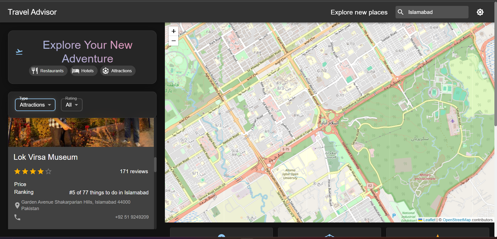
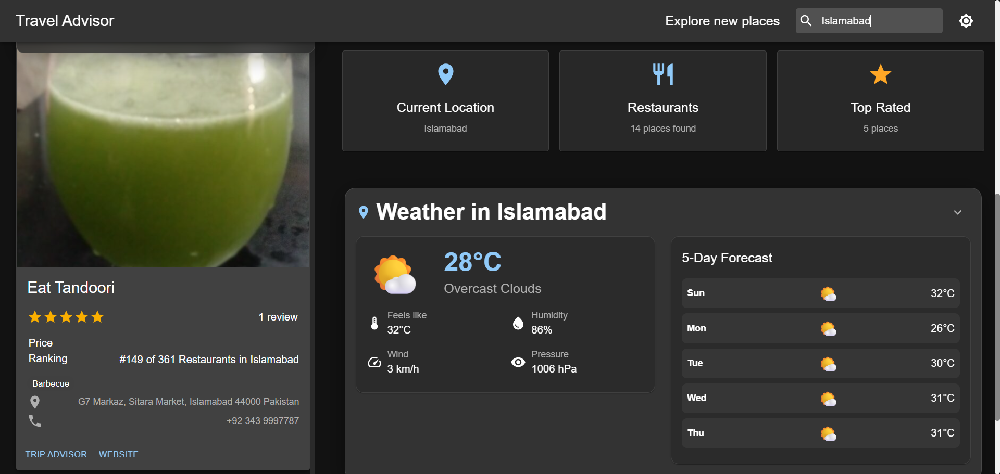

# 🌍 Travel Advisor - Interactive Travel & Weather App

A modern, responsive travel application that helps you discover restaurants, hotels, and attractions near you with real-time weather forecasts. Built with React, Material-UI, and powered by RapidAPI.

## 📸 Screenshots

### Interactive Map Interface


*Interactive map view showing the search interface with "Explore Your New Adventure" title, type selection chips (Restaurants, Hotels, Attractions), filter dropdowns, and detailed place information. The map displays location markers and allows users to explore different areas.*

### Weather & Stats Dashboard


*Weather dashboard showing current weather conditions, 5-day forecast, and Quick Stats Panel with location information, number of places found, and top-rated places count. Features real-time weather data with temperature, humidity, wind speed, and pressure metrics.*

> **Note**: These screenshots showcase the two main interfaces - the interactive map for place discovery and the weather dashboard for current conditions and forecasts.

## ✨ Features

### 🍽️ **Restaurant Discovery**
- Find restaurants near your location or any searched area
- View ratings, reviews, pricing, and contact information
- Filter by rating (3.0+, 4.0+, 4.5+)
- Real-time location-based recommendations

### 🏨 **Hotel Search**
- Discover hotels in your area
- View amenities, ratings, and booking information
- Perfect for travel planning

### 🎡 **Attractions & Activities**
- Explore local attractions and points of interest
- Get detailed information about tourist spots
- Plan your itinerary with ease

### 🌤️ **Weather Integration**
- Real-time weather data for any location
- 5-day weather forecast
- Current conditions with detailed metrics
- Automatic weather updates based on search location

### 🎨 **Modern UI/UX**
- **Dark & Light Theme** - Toggle between themes for comfortable viewing
- **Responsive Design** - Works perfectly on desktop and mobile
- **Interactive Map** - Visual location exploration with Leaflet
- **Fixed Header** - Easy navigation with sticky search bar
- **Smooth Animations** - Beautiful transitions and hover effects
- **Glassmorphism Design** - Modern glass-like UI elements

### 📊 **Quick Stats Panel**
- Current location display
- Number of places found
- Top-rated places count
- Real-time statistics

## 🚀 Getting Started

### Prerequisites
- Node.js (v14 or higher)
- npm or yarn
- RapidAPI account

### Installation

1. **Clone the repository**
   ```bash
   git clone <repository-url>
   cd travel_advisor
   ```

2. **Install dependencies**
   ```bash
   npm install
   ```

3. **Set up Environment Variables**

   Create a `.env` file in the root directory:
   ```env
   REACT_APP_RAPIDAPI_KEY=your_rapidapi_key_here
   REACT_APP_RAPIDAPI_HOST=travel-advisor.p.rapidapi.com
   ```

   **How to get your RapidAPI key:**
   1. Go to [RapidAPI](https://rapidapi.com/)
   2. Sign up or log in to your account
   3. Search for "Travel Advisor" API
   4. Subscribe to the free plan (500 requests/month)
   5. Copy your API key from the dashboard
   6. Replace `your_rapidapi_key_here` with your actual API key

4. **Start the development server**
   ```bash
   npm start
   ```

5. **Open your browser**
   Navigate to `http://localhost:3000`

## 📱 How to Use

### 🔍 **Searching for Places**
1. **Location Search**: Use the search bar in the header to find places in any city
2. **Current Location**: The app automatically detects your location and shows nearby places
3. **Type Selection**: Choose between Restaurants, Hotels, or Attractions using the dropdown
4. **Rating Filter**: Filter places by minimum rating (All, 3.0+, 4.0+, 4.5+)

### 🗺️ **Interactive Map**
- **Zoom Controls**: Use + and - buttons to zoom in/out
- **Location Markers**: Click on map markers to see place details
- **Area Selection**: The map automatically updates when you search for new locations

### 🌤️ **Weather Information**
- **Current Weather**: View real-time weather conditions
- **5-Day Forecast**: Plan ahead with extended weather predictions
- **Detailed Metrics**: Temperature, humidity, wind speed, and pressure
- **Location-Based**: Weather updates automatically based on your search location

### 🎨 **Theme Switching**
- **Dark Mode**: Click the settings icon in the header to toggle dark theme
- **Light Mode**: Perfect for daytime use
- **Automatic**: Theme preference is saved for your next visit

## 🛠️ Technical Stack

- **Frontend**: React 18, Material-UI 5
- **Styling**: CSS-in-JS with makeStyles
- **Maps**: React-Leaflet with OpenStreetMap
- **API**: RapidAPI Travel Advisor
- **Weather**: OpenWeatherMap API
- **Icons**: Material-UI Icons
- **Build Tool**: Create React App

## 📁 Project Structure

```
travel_advisor/
├── public/
│   └── index.html
├── src/
│   ├── api/
│   │   └── index.js          # API configuration and requests
│   ├── components/
│   │   ├── Header/           # Navigation and search
│   │   ├── List/             # Place listings and filters
│   │   ├── Map/              # Interactive map component
│   │   ├── PlaceDetails/     # Individual place cards
│   │   └── Weather/          # Weather display component
│   ├── App.js                # Main application component
│   └── index.js              # Application entry point
├── .env                      # Environment variables
└── package.json
```

## 🔧 Configuration

### API Rate Limits
- **Free Plan**: 500 requests per month
- **Rate Limiting**: Built-in 2-second delay between requests
- **Error Handling**: Graceful handling of API limits

### Environment Variables
```env
# Required for API access
REACT_APP_RAPIDAPI_KEY=your_api_key_here
REACT_APP_RAPIDAPI_HOST=travel-advisor.p.rapidapi.com
```

## 🎯 Key Features Explained

### **Location-Based Discovery**
The app uses your browser's geolocation to automatically find places near you. When you search for a new location, it updates both the places and weather information.

### **Real-Time Data**
- **Places**: Live data from Travel Advisor API
- **Weather**: Current conditions and forecasts
- **Map**: Interactive location visualization

### **Responsive Design**
- **Desktop**: Full-featured layout with side-by-side panels
- **Mobile**: Optimized for touch interaction
- **Tablet**: Adaptive layout for medium screens

### **Performance Optimizations**
- **Lazy Loading**: Components load as needed
- **Caching**: API responses are cached for better performance
- **Debouncing**: Search requests are optimized

## 🚨 Troubleshooting

### Common Issues

1. **API Key Not Working**
   - Ensure your RapidAPI key is correct
   - Check if you've exceeded your monthly limit
   - Verify the API host is correct

2. **Location Not Detected**
   - Allow location access in your browser
   - Check if HTTPS is enabled (required for geolocation)

3. **Weather Not Loading**
   - Verify your internet connection
   - Check browser console for errors

4. **Map Not Displaying**
   - Ensure you have an active internet connection
   - Check if any ad blockers are interfering

### Error Messages
- **"Too Many Requests"**: You've exceeded your API limit
- **"Location Access Denied"**: Browser location permission required
- **"Network Error"**: Check your internet connection

## 🤝 Contributing

1. Fork the repository
2. Create a feature branch (`git checkout -b feature/AmazingFeature`)
3. Commit your changes (`git commit -m 'Add some AmazingFeature'`)
4. Push to the branch (`git push origin feature/AmazingFeature`)
5. Open a Pull Request

## 📄 License

This project is licensed under the MIT License - see the [LICENSE](LICENSE) file for details.

## 🙏 Acknowledgments

- **RapidAPI** for the Travel Advisor API
- **OpenWeatherMap** for weather data
- **OpenStreetMap** for map tiles
- **Material-UI** for the beautiful component library
- **React-Leaflet** for map integration

## 📞 Support

If you encounter any issues or have questions:
1. Check the troubleshooting section above
2. Review the browser console for error messages
3. Ensure all environment variables are set correctly
4. Verify your API key is active and has remaining requests

---

**Happy Traveling! 🌍✈️**

*Built with ❤️ using React and Material-UI*
